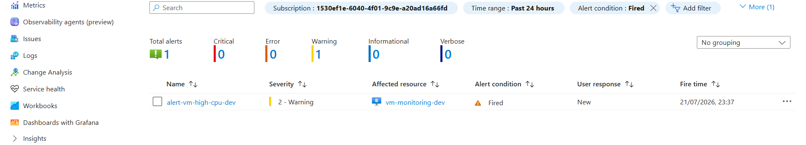
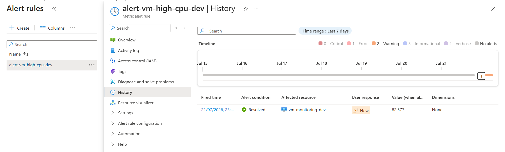
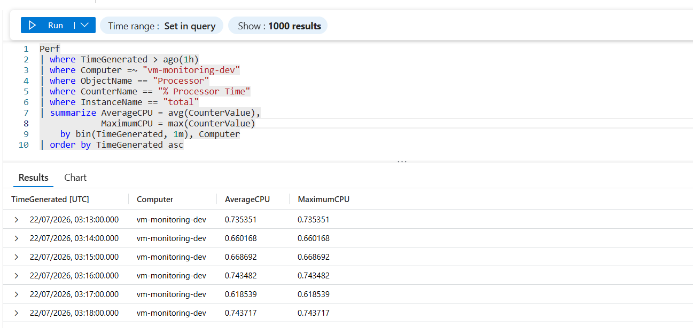
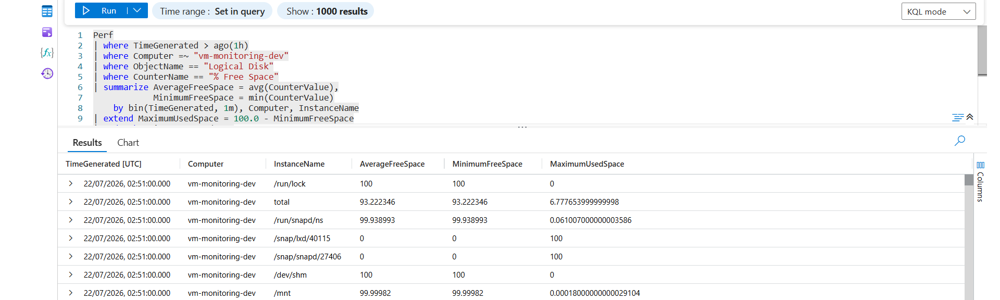

# Azure VM Monitoring and Incident Response

A hands-on Azure operations project that deploys a monitored Ubuntu virtual machine with Bicep, collects Linux performance data in Log Analytics, detects sustained CPU pressure with Azure Monitor, sends email notifications through an Action Group, and documents the investigation and recovery workflow.


## Project outcomes

This project demonstrates an end-to-end monitoring and incident-response lifecycle:

- Deploy repeatable Azure infrastructure with modular Bicep templates.
- Restrict SSH access to a single administrator IP address.
- Install the Azure Monitor Agent on a Linux VM.
- Collect CPU, memory, and disk performance counters with a Data Collection Rule.
- Send telemetry to a Log Analytics workspace with 30-day retention.
- Detect sustained CPU usage above 70% with a metric alert.
- Notify an operator by email through an Azure Monitor Action Group.
- Generate controlled CPU and disk test conditions.
- Investigate telemetry with reusable KQL queries.
- Record incident response, remediation, validation, and lessons learned.

## Architecture

The deployment creates a single development resource group in Canada Central. The Linux VM is attached to a subnet protected by a Network Security Group. Azure Monitor Agent forwards selected performance counters through a Data Collection Rule to Log Analytics. A platform metric alert evaluates VM CPU every minute over a five-minute window and invokes the Action Group when the threshold is exceeded.

| Area | Azure resource or component | Purpose |
|---|---|---|
| Compute | Ubuntu 22.04 LTS VM | Monitored workload and incident simulation target |
| Networking | VNet, subnet, NSG, public IP, NIC | Network placement and restricted SSH access |
| Telemetry | Azure Monitor Agent | Sends guest operating-system telemetry |
| Collection | Data Collection Rule and association | Selects CPU, memory, and disk counters and associates them with the VM |
| Analytics | Log Analytics workspace | Stores and queries performance records |
| Detection | Azure Monitor metric alert | Detects average CPU above 70% for five minutes |
| Notification | Action Group | Sends common-schema email notifications |
| Operations | Bash scripts, KQL, runbooks | Simulates, investigates, and resolves incidents |

See [Architecture](docs/architecture.md) for the design and data flow.

## Repository structure

```text
.
├── infrastructure/
│   ├── main.bicep
│   ├── main.dev.bicepparam.example
│   └── modules/
│       ├── monitoring.bicep
│       ├── networking.bicep
│       └── virtual-machine.bicep
├── queries/
│   ├── cpu-investigation.kql
│   ├── data-ingestion-status.kql
│   └── disk-investigation.kql
├── scripts/
│   ├── cleanup-test-files.sh
│   ├── generate-cpu-load.sh
│   └── generate-disk-usage.sh
├── docs/
│   ├── architecture.md
│   ├── cleanup.md
│   ├── deployment.md
│   ├── incident-report.md
│   ├── troubleshooting.md
│   ├── diagrams/
│   ├── runbooks/
│   └── screenshots/
├── .gitignore
├── LICENSE
└── README.md
```

## Deployment

### Prerequisites

- Azure subscription with permission to deploy subscription- and resource-group-scoped resources
- Azure CLI with Bicep support
- Bash-compatible shell
- SSH key pair
- Public IPv4 address for the NSG allow rule
- Email address for alert notifications

### Configure parameters

Create the ignored local parameter file from the example:

```bash
cp infrastructure/main.dev.bicepparam.example infrastructure/main.dev.bicepparam
```

Replace the placeholder SSH public key, administrator source IP, and notification email. The local file is ignored so environment-specific values are not committed.

### Validate and preview

```bash
az bicep build --file infrastructure/main.bicep
rm -f infrastructure/main.json

az deployment sub what-if \
  --location canadacentral \
  --template-file infrastructure/main.bicep \
  --parameters infrastructure/main.dev.bicepparam
```

### Deploy

```bash
az deployment sub create \
  --name deploy-vm-monitoring-incident-response \
  --location canadacentral \
  --template-file infrastructure/main.bicep \
  --parameters infrastructure/main.dev.bicepparam \
  --output table
```

The deployment outputs the VM name, public IP address, workspace name, alert name, and an SSH command. Detailed steps and verification commands are in [Deployment and validation](docs/deployment.md).

## Controlled incident demonstration

### High CPU incident

Copy the script to the VM and run it for the default eight minutes:

```bash
scp scripts/generate-cpu-load.sh azureadmin@<VM_PUBLIC_IP>:~
ssh azureadmin@<VM_PUBLIC_IP>
chmod +x generate-cpu-load.sh
./generate-cpu-load.sh
```

The alert evaluates `Percentage CPU` every minute and fires when the five-minute average exceeds 70%. After the script exits, CPU returns to normal and the alert automatically resolves.

Use [cpu-investigation.kql](queries/cpu-investigation.kql) to compare one-minute average and maximum CPU values. Follow the [High CPU response runbook](docs/runbooks/high-cpu-response.md) for triage and recovery.

### Disk usage investigation

```bash
scp scripts/generate-disk-usage.sh scripts/cleanup-test-files.sh azureadmin@<VM_PUBLIC_IP>:~
ssh azureadmin@<VM_PUBLIC_IP>
chmod +x generate-disk-usage.sh cleanup-test-files.sh
./generate-disk-usage.sh
```

The script creates a temporary 3 GB file under `/var/tmp/azure-monitoring-lab`. Use [disk-investigation.kql](queries/disk-investigation.kql) to review free-space telemetry, then remove the file:

```bash
./cleanup-test-files.sh
```

Follow the [Disk usage response runbook](docs/runbooks/disk-usage-response.md) for a structured investigation.

> The scripts are intended only for a controlled lab VM. Review the target and available capacity before running them elsewhere.

## Evidence

The repository includes deployment and operational evidence covering:

- Bicep deployment and Azure resources
- VM, networking, workspace, DCR, and association
- Action Group and alert configuration
- CPU load generation and metric spike
- Fired and resolved alert lifecycle
- Email notification
- CPU, disk, and ingestion KQL results
- Linux VM access and operating-system checks

Browse the numbered evidence in the [Screenshot index](docs/screenshots/README.md).

Key examples:

| Alert fired | Alert resolved |
|---|---|
|  |  |

| CPU investigation | Disk investigation |
|---|---|
|  |  |

## Incident result

The simulated high-CPU condition triggered the severity-2 alert and notification path as designed. The condition cleared after the workload stopped, and Azure Monitor changed the alert state to resolved. Log Analytics retained the performance history for investigation. The complete record is in [Incident report](docs/incident-report.md).

## Security and cost controls

- Password authentication is disabled; the VM accepts SSH keys only.
- The NSG allows TCP/22 only from the configured administrator CIDR.
- Environment-specific parameter values are excluded from source control.
- Screenshots redact public IP and email values where displayed.
- The project uses one VM and a single Log Analytics workspace to keep the lab compact.
- Resources should be deleted after validation to avoid ongoing VM, disk, public IP, and log-ingestion charges.

See [Cleanup](docs/cleanup.md) for safe removal.

## Design boundaries

This is a focused portfolio lab rather than a production landing zone. It intentionally does not include private endpoints, Azure Bastion, multi-region resilience, autoscaling, ITSM integration, or a full observability platform. In a production environment, those decisions would depend on organizational security, availability, and operating requirements.

## Skills demonstrated

Azure, Bicep, Azure CLI, Linux administration, Azure Monitor, Log Analytics, Azure Monitor Agent, Data Collection Rules, metric alerts, Action Groups, KQL, Bash automation, incident response, troubleshooting, and technical documentation.

## License

This project is licensed under the [MIT License](LICENSE).
