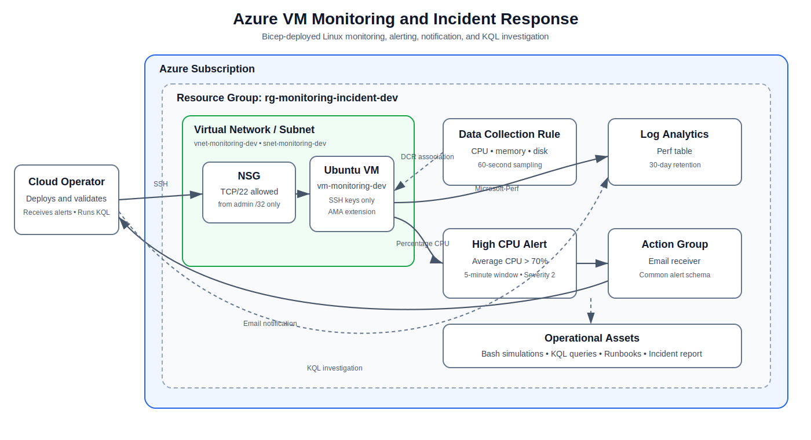

# Architecture

## Overview

The project deploys a compact Azure monitoring environment for a single Ubuntu virtual machine. Infrastructure is defined with modular Bicep and deployed at subscription scope so the template can create its own resource group.

## Resource flow

1. The subscription-scoped template creates `rg-monitoring-incident-dev` in Canada Central.
2. The networking module creates a VNet, subnet, and NSG. TCP/22 is allowed only from the administrator CIDR supplied at deployment time.
3. The virtual-machine module creates a Standard public IP, NIC, Ubuntu VM, managed OS disk, system-assigned identity, and Azure Monitor Agent extension.
4. The monitoring module creates a Log Analytics workspace and a Linux Data Collection Rule.
5. The DCR association connects the rule to the VM and collects selected `Perf` counters once per minute.
6. Azure Monitor evaluates the VM platform metric `Percentage CPU` every minute using a five-minute window.
7. When average CPU exceeds 70%, the severity-2 alert invokes the Action Group and sends an email notification.
8. Operators use reusable KQL queries and documented runbooks to investigate and verify recovery.

## Components

### Networking

- **VNet:** `vnet-monitoring-dev` with address space `10.30.0.0/16`
- **Subnet:** `snet-monitoring-dev` with prefix `10.30.1.0/24`
- **NSG:** `nsg-monitoring-vm-dev`
- **Inbound rule:** SSH from one configurable `/32` administrator address

The public endpoint exists to keep the lab simple. A production design would normally prefer Azure Bastion, VPN/ExpressRoute, private access, or just-in-time VM access.

### Compute

- **VM:** `vm-monitoring-dev`
- **Image:** Ubuntu Server 22.04 LTS Gen2
- **Authentication:** SSH public key; passwords disabled
- **Disk:** 30 GB Standard SSD managed disk
- **Identity:** System-assigned managed identity
- **Extension:** Azure Monitor Linux Agent with automatic upgrades enabled

### Telemetry collection

The DCR collects these Linux counters every 60 seconds:

- `Processor(*)\\% Processor Time`
- `Memory\\Available MBytes`
- `Memory\\% Used Memory`
- `Logical Disk(*)\\% Free Space`
- `Logical Disk(*)\\Disk Reads/sec`
- `Logical Disk(*)\\Disk Writes/sec`

Records are written to the `Perf` table in `law-monitoring-incident-dev`. The workspace uses the `PerGB2018` pricing tier and 30-day retention.

### Alerting

The high-CPU metric alert is configured with:

| Setting | Value |
|---|---|
| Metric | `Percentage CPU` |
| Aggregation | Average |
| Operator | Greater than |
| Threshold | 70% |
| Window | 5 minutes |
| Evaluation frequency | 1 minute |
| Severity | 2 |
| Auto-mitigation | Enabled |
| Action | Email through `ag-monitoring-operations-dev` |

The metric alert uses Azure platform metrics for timely detection. Log Analytics is used for guest-level investigation and historical context.

## Bicep module boundaries

| Module | Responsibility |
|---|---|
| `main.bicep` | Resource group, shared tags, module orchestration, deployment outputs |
| `networking.bicep` | NSG, VNet, subnet, and SSH source restriction |
| `virtual-machine.bicep` | Public IP, NIC, VM, managed identity, boot diagnostics, AMA extension |
| `monitoring.bicep` | Workspace, DCR, DCR association, Action Group, metric alert |

## Design decisions

- **One resource group:** makes lifecycle management and cleanup straightforward for a portfolio lab.
- **Platform metric for detection:** avoids log-ingestion delay in the critical alert path.
- **Guest metrics for investigation:** provides CPU, memory, and filesystem context unavailable from the platform metric alone.
- **Reusable scripts and queries:** makes the demonstration repeatable without introducing a separate workload application.
- **Static threshold:** easy to explain and validate in a controlled environment; production workloads may benefit from dynamic thresholds or baseline-aware detection.

## Production improvements

A production implementation could add private connectivity, Azure Bastion, Azure Policy, Defender for Cloud, centralized workspaces, diagnostic settings, additional alert rules, workload-specific SLOs, availability monitoring, ITSM/webhook integration, dashboards/workbooks, and role-based access separation.
